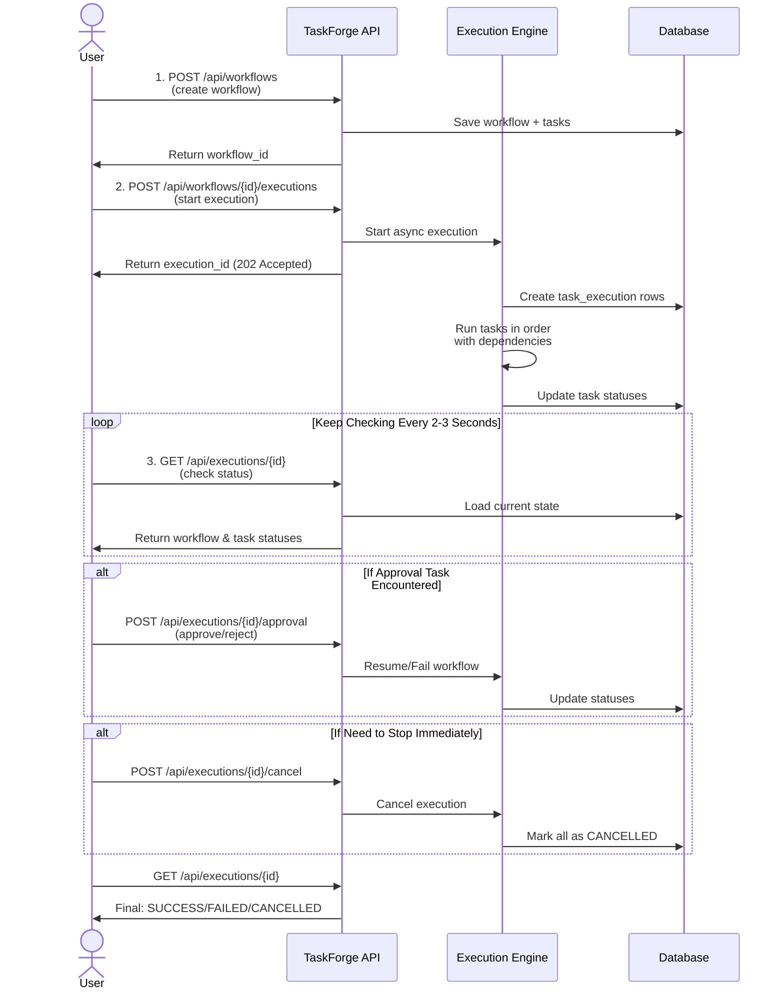

# TaskForge Execution Sequence Diagram

This diagram shows the interaction flow between client, API, engine, and database during workflow execution.



## Step-by-Step Explanation

### 1. Create Workflow
```
POST http://localhost:8090/api/workflows

Body:
{
  "name": "deployment-pipeline",
  "tasks": [
    { "id": "build", "type": "script", "dependsOn": [] },
    { "id": "test", "type": "script", "dependsOn": ["build"] },
    { "id": "deploy", "type": "http", "dependsOn": ["test"] }
  ]
}

Response: 201 Created
{
  "id": "workflow-123",
  "name": "deployment-pipeline",
  "tasks": [...]
}
```

### 2. Start Execution
```
POST http://localhost:8090/api/workflows/workflow-123/executions

Response: 202 Accepted
{
  "id": "execution-456",
  "workflowDefinitionId": "workflow-123",
  "status": "CREATED",
  "tasks": {
    "build": "PENDING",
    "test": "PENDING",
    "deploy": "PENDING"
  }
}
```

### 3. Poll Status (Keep Checking)
```
GET http://localhost:8090/api/executions/execution-456

Response: 200 OK
{
  "id": "execution-456",
  "status": "RUNNING",
  "tasks": {
    "build": "SUCCESS",
    "test": "RUNNING",
    "deploy": "PENDING"
  }
}

[after a few seconds]

{
  "id": "execution-456",
  "status": "SUCCESS",
  "tasks": {
    "build": "SUCCESS",
    "test": "SUCCESS",
    "deploy": "SUCCESS"
  }
}
```

### 4. Approve (Optional - if workflow has approval task)
```
POST http://localhost:8080/api/executions/execution-456/approval

Body:
{
  "taskId": "approval-gate",
  "approved": true,
  "approver": "john.doe@example.com",
  "reason": "Looks good"
}

Response: 200 OK
```

### 5. Cancel (Optional - anytime)
```
POST http://localhost:8080/api/executions/execution-456/cancel

Response: 202 Accepted
```

## Timing Notes

- **Create Workflow** = Synchronous (waits for validation and DB save)
- **Start Execution** = Asynchronous (returns immediately, engine runs in background)
- **Poll Status** = Synchronous (returns instantly from DB)
- **Approve** = Synchronous (resumes engine immediately)
- **Cancel** = Synchronous (sets flag, engine stops ASAP)

## Database Changes Per Step

### After Create Workflow
```
workflow_definition table: 1 row
task_definition table: N rows (one per task)
```

### After Start Execution
```
workflow_execution table: 1 row (status: CREATED)
task_execution table: N rows (all PENDING)
```

### During Execution
```
task_execution table: rows update (PENDING -> RUNNING -> SUCCESS/FAILED/SKIPPED)
workflow_execution table: updates (status: RUNNING, outputs merge)
```

### After Execution Complete
```
workflow_execution table: 1 row (status: SUCCESS/FAILED/CANCELLED)
task_execution table: N rows (all terminal)
```
