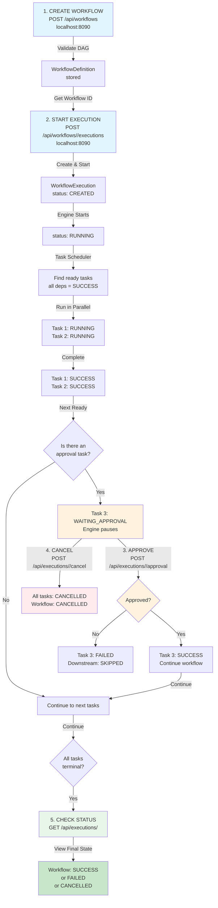

# TaskForge Workflow Execution Flow

This diagram shows the complete state transitions and decision points during a workflow execution.



## Key Points

- **Blue boxes** = API calls you make
- **Orange boxes** = Approval decision points
- **Red boxes** = Cancellation flow
- **Green boxes** = Final status checks

## Example Scenario

### Successful Flow
```
build (SUCCESS)
  ↓
test (SUCCESS)
  ↓
approval-gate → [you approve] → SUCCESS
  ↓
deploy (SUCCESS)
  ↓
Workflow: SUCCESS
```

### Rejection Flow
```
build (SUCCESS)
  ↓
test (SUCCESS)
  ↓
approval-gate → [you reject] → FAILED
  ↓
deploy (SKIPPED - never runs)
  ↓
Workflow: FAILED
```

### Cancellation Flow
```
build (SUCCESS)
  ↓
test (RUNNING)
  ↓
[you cancel]
  ↓
test (CANCELLED)
approval-gate (CANCELLED)
deploy (CANCELLED)
  ↓
Workflow: CANCELLED
```
